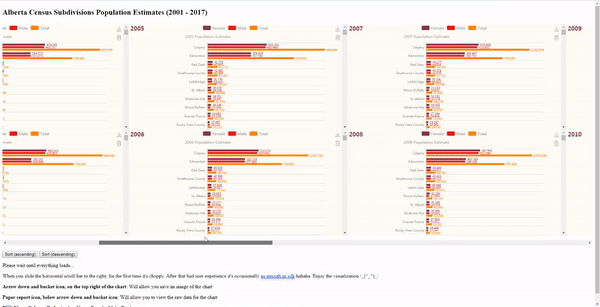

 
### Credits
- <a href="https://ecomfe.github.io/echarts-doc/public/en/tutorial.html#Get%20Started%20with%20ECharts%20in%205%20minutes" target="_blank">Echarts Documentation</a>
- <a href="https://ecomfe.github.io/echarts-examples/public/view.html?c=doc-example/label-position" target="_blank">Label Placement</a>
- <a href="https://ecomfe.github.io/echarts-examples/public/editor.html?c=bar-y-category-stack" target="_blank">Stacked Bar Chart</a>
- <a href="https://stackoverflow.com/questions/16128604/scrollable-canvas-inside-div" target="_blank">Scrollable canvas inside div</a>
- <a href="https://open.alberta.ca/opendata/population-estimates-by-age-and-sex-alberta-census-subdivisions-july-1-2001-2017" target="_blank">Population Estimates by Age and Sex, Alberta Census Subdivisions (July 1, 2001-2017) - Open Data </a>
- <a href="https://ecomfe.github.io/echarts-examples/public/editor.html?c=bar-y-category" target="_blank">World Total Population</a>
- <a href="https://beta.observablehq.com/@mikelotis/october-quater-alberta-total-population-estimates-1951-20" target="_blank">October Quater, Alberta Total Population Estimates: 1951 - 2017</a>
- <a href="https://haltu.github.io/muuri/" target="_blank">Muuri</a>
- <a href="http://echarts.baidu.com/theme-builder/" target="_blank">Echarts-Theme Builder</a>
- <a href="https://www.youtube.com/watch?v=ZEBnX9Pi8bE" target="_blank">Muuri - Sortable and draggable grid layouts (Youtube Tutorial)</a>
- <a href="https://codepen.io/niklasramo/pen/EvXoOG" target="_blank">Help for implementing Sort for Muuri</a>
- <a href="https://beta.observablehq.com/@tmcw/module-require-debugger" target="_blank">Helper to load Web Animations</a>

#### Look at these and learn them, in the future
- <a href="http://workshop.chromeexperiments.com/examples/gui/#1--Basic-Usage" target="_blank">dat.GUI</a>
- <a href="https://stackoverflow.com/questions/31496239/div-overflow-doesnt-work-with-canvas" target="_blank">Canvas Overflow</a>
- <a href="https://codepen.io/Olliebaba/pen/pyaEBJ" target="_blank">Gridstack - CodePen 1</a>
- <a href="https://codepen.io/AKay/pen/GZXEJx" target="_blank">Gridstack - CodePen 2</a>
- <a href="https://www.youtube.com/watch?v=PDG-GqmUZss" target="_blank">Youtube - Muuri Tutorial</a>

### My Other Projects
Criticism and feedback highly recommended.  
Shoot me an <a href="https://mikelotis.github.io/#web" target="_blank">email</a> or message me <a href="https://twitter.com/Michael_Otyz" target="_blank">@Michael_Otyz</a>.
- <a href="https://mikelotis.github.io/" target="_blank"><strong>OTHER PROJECTS</strong></a>
